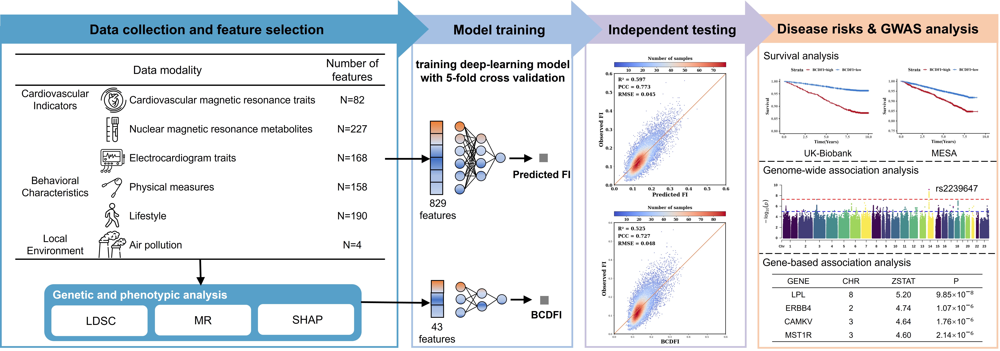

# Measuring Frailty by integrating behavioural and cardiovascular indicators through a deep-learning model
An frailty index (FI) is associated with mortality and vulnerability to adverse health outcomes. Current methods to calculate FI used uneasily accessible indicators, restricting its applications. 

By integrating BCs and CIs showing genetic causal effects on FI, a deep-learning model was developed to predict FI (BCDFI). The BCDFI is associated with the risks of multiple diseases and can perform GWAS analysis. 

The code was built based on [AMFormer](https://github.com/aigc-apps/AMFormer/). Thanks a lot for their code sharing!

The trained model parameters can be downloaded from https://drive.google.com/file/d/1t5a8IMKolmHNc4XL66wS_tUr1WnkqDha/view?usp=sharing and put it under the directory './data/model/'.

### Python version
3.7.9
### Dependencies
requirement.txt
### File description
1) Trained model parameters file: `./data/model/model.pth`
2) Input file: The `./data/cate_feat.csv` stores the categorical input variables and `./data/cont_feat.csv` stores the continuous input variables, which meet the input requirements of AMFormer model. The provided data is synthetic, but you can use data from the real world.

### Testing
To run the code on the demo dataset, run:
`python -u main.py --save_dir ./result --gpu_id 7`

The prediction results are saved to the file `./result/result.csv` .

